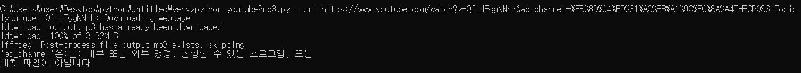

# useful_tools
터미널에서 실행할 수 있는 유용한 파일들입니다.


## 1. Youtube2mp3.py
- Youtube url을 입력하면 output.mp3 파일을 생성합니다.
- [ffmpeg 설치가 필요합니다.](https://blog.naver.com/chandong83/222095346417)
- 사용 예시
```
python youtube2mp3.py --url [url]
```

  - 에러가 나오지만 무시하셔도 괜찮습니다..

## 2. get_text.py
- 오디오파일(mp3, wav)을 입력하면 음성인식하여 텍스트파일을 생성합니다.
- 먼저 [etri api key](https://aiopen.etri.re.kr/guide_recognition.php)를 발급 받아야 합니다.
- 다음의 패키지를 설치하셔야 합니다.
```
pip install librosa numpy==1.19.3 pydub
```
- 사용 예시
```
python get_text.py --fname [fname] --api [api key]
```

